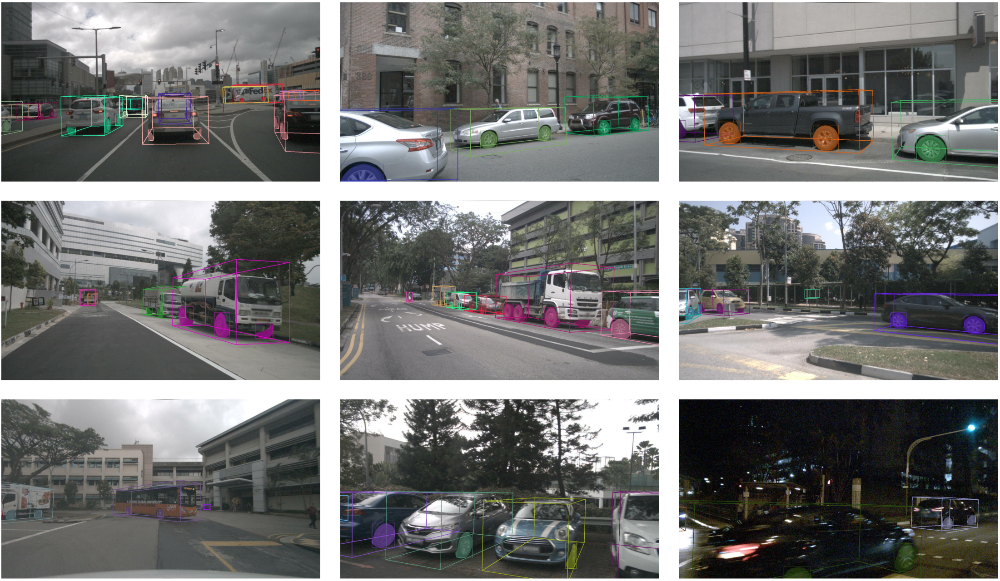

# A Wheel Dataset for Autonomous Driving


## News

- 🔥**2025-12-01**: Release v1.0-mini.

## Introduction



Wheels provide a universal geometric structure that enables precise and consistent annotation, which hold substantial
potential for supporting vehicle detection and pose estimation. However, wheel detection in autonomous driving systems
has received limited research attention and lacks dedicated datasets.

To address this issue, we construct and release a wheel dataset based on [nuScenes](https://www.nuscenes.org/),
providing:

- 2D Bounding Boxes,
- Pixel-Level Segmentation Masks,
- Wheel-Vehicle Association Labels.

## Downloads

Following the structure of the [nuScenes](https://www.nuscenes.org/) dataset, we generate three versions:

- v1.0-trainval
- v1.0-test
- v1.0-mini.

The smaller v1.0-mini subset offers a convenient option for initial exploration and rapid prototyping.

The dataset can be downloaded at: [Wheel Dataset](https://pan.baidu.com/s/16IA8So0BHwHOyM4yT5y1AA?pwd=mina)

## Annotations

The annotations are provided in the following **JSON** formats:

```json
{
  "n015-2018-07-24-11-22-45+0800__CAM_FRONT__1532402935662460": {
    "scores": [
      0.7676898241043091,
      0.6984323263168335,
      ...
    ],
    "boxes": [
      [
        162.60946655273438,
        519.4454956054688,
        201.25282287597656,
        583.3193969726562
      ],
      [
        422.3385314941406,
        580.2855834960938,
        465.64898681640625,
        604.3241577148438
      ],
      ...
    ],
    "masks": [
      [
        [
          520,
          170
        ],
        [
          520,
          171
        ],
        ...
      ],
      ...
    ],
    "mask_scores": [
      0.88671875,
      0.93359375,
      ...
    ],
    "wheel_num": 3,
    "wheel_tokens": [
      "9695de5e535e45a7af2be6bbdd8ab6f1",
      "011e076fae7a4a4ebba7ebbdab60df49",
      ...
    ],
    "assoc_box_tokens": [
      "b9dcffffb5b441178705f39d7582e34c",
      "2fc559f2d63349f89df453b7831feacf",
      ...
    ]
  },
  ...
}
```

- "**n015-2018-07-24-11-22-45+0800__CAM_FRONT__1532402935662460**" is the image file name, which is also the key of the
  annotation dictionary.
- "**scores**" is the detection scores of wheel 2D bounding boxes.
- "**boxes**" is the 2D bounding boxes of wheels, each box is with four coordinates (umin, vmin, umax, vmax).
- "**masks**" is the pixel-level segmentation masks of wheels, each pixel is with two coordinates (v, u).
- "**mask_scores**" is the scores of pixel-level segmentation masks.
- "**wheel_num**" is the number of wheels in the image.
- "**wheel_tokens**" is the token of wheels using UUID number. (NOTE: no tracking annotations, i.e., the wheel token is
  not
  the same for the same wheel in different images)
- "**assoc_box_tokens**" is the token of associated vehicle in [nuScenes](https://www.nuscenes.org/) dataset.

## TODOs

- [ ] v1.0-trainval
- [ ] v1.0-test